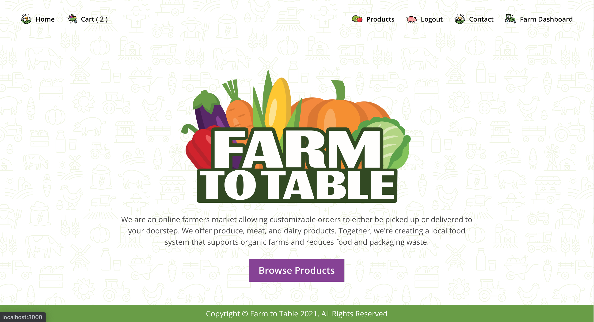
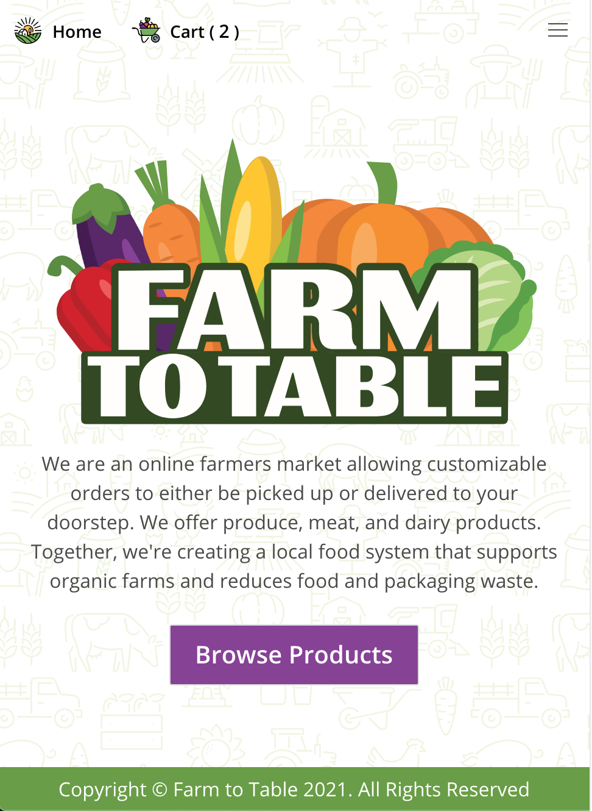

# **Farm to Table**
  
  
  ## **Table of Contents**
  * [Contributors](#contributors)
  * [Questions](#questions)
  * [License](#license)
  * [Credits](#credits)
      
  ## **Live Link**
  https://glacial-falls-13622.herokuapp.com/      
  ## **Description**
  Farm to Table is a mobile-responsive web application connecting consumers with local farms for fresh produce reservations. The platform offers seamless product browsing with seasonal availability, a dynamic shopping cart system, and secure order placement. Customers can view their order history, while farm administrators manage products, seasonal offerings, and inventory. Recent enhancements include a direct messaging system with notification badges, PDF invoice generation with on-screen preview and download capabilities, improved product image management supporting multiple photos per item, and a streamlined contact form powered by EmailJS for customer inquiries. Built to support local agriculture, Farm to Table bridges the gap between farmers and consumers seeking fresh, locally-sourced food, with plans to expand to a multi-farm platform in the future.
  ## **Demo**
  #### **Desktop/Laptop**
  

  #### **Mobile**
  

      
   ## **Contributors**
  * [Melanie Bostwick](https://github.com/mbostwick1)

  * [Stephany Bolivar](https://github.com/gstephbolivar)  

  * [Rashawn Raiford](https://github.com/raiford2530)
      
  * [Robert Anderson](https://github.com/reanderson89)

  * [Neil Gandhi](https://github.com/ntch2000)

  * [Jeewaka Supun](https://github.com/J33WAKASUPUN)

  
  ## **Technology Stack**
  Server Side: javascript, bcrypt, .env, jsonwebtokens, mjml, node-sass, nodemailer, nodemon, nodemailer-express-handlebars, mongoose

  Client Side: javascript, axios, jsonwebtokens, mjml, node-sass, nodemailer-express-handlebars, prop-types, react, react-dom, react-router-dom, react-scripts, react-toastify, web-vitals, moment.js

  Database: MongoDB
  

  ## **Questions**   
  ####    **For any questions or inquiries please contact us at,**

**Melanie Bostwick**
  * #### **GitHub:** [@mbostwick1](https://github.com/mbostwick1)
  * #### **Email:** [mbostwick1@gmail.com](mbostwick1@gmail.com)

 **Stephany Bolivar**
  * #### **GitHub:** [@gstephbolivar](https://github.com/gstephbolivar)
  * #### **Email:** [g.stephanybolivar@gmail.com](g.stephanybolivar@gmail.com)
  
**Rashawn Raiford**
  * #### **GitHub:** [@raiford2530](https://github.com/raiford2530)
  * #### **Email:** [raiford87@gmail.com](raiford87@gmail.com)

**Robert Anderson**
  * #### **GitHub:** [@reanderson89](https://github.com/reanderson89)
  * #### **Email:** [reanderson89@gmail.com](reanderson89@gmail.com)

**Robert Anderson**
  * #### **GitHub:** [@ntch2000](https://github.com/ntch2000)
  * #### **Email:** [ngtych4@gmail.com](ngtych4@gmail.com)

**Jeewaka Supun**
  * #### **GitHub:** [@J33WAKASUPUN](https://github.com/J33WAKASUPUN)
  * #### **Email:** [supunprabodha789@gmail.com](supunprabodha789@gmail.com)

  ## **Credits**
   * [Bulma](https://bulma.io/)
   * [Font awesome](https://fontawesome.com/)
   * [Bulma NavBar functionality](https://codepen.io/Nikitoss334/pen/VOEdVY)
   * [Shutterstock: Skeleton Icon](https://www.shutterstock.com/g/rudiak)
   * [Shutterstock: sokolfly](https://www.shutterstock.com/g/artemsokol)
   * [Shutterstock: Ramosh Artworks](https://www.shutterstock.com/g/ramoshed)
   * [Shutterstock: Sudowoodo](https://www.shutterstock.com/g/Sudowoodo)

  
    
  ## **License**
  MIT
      
